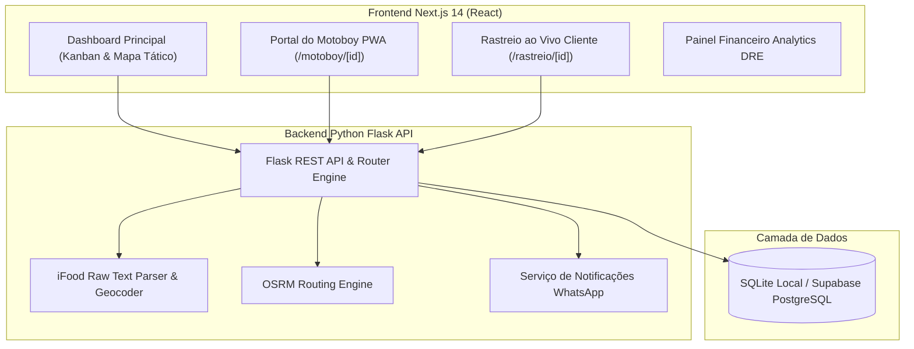

# ⚡ VoltzDelivery - Plataforma de Inteligência & Expedição Logística

Plataforma completa de **Gestão Logística, Expedição em Tempo Real e Rastreamento de Entregas** desenvolvida especificamente para operar em alta velocidade durante horários de pico em delivery de restaurantes.

O sistema integra pedidos oriundos do **Cardápio Web** e **iFood**, oferece um **Mapa Tático Interativo com Inteligência Geográfica**, **Portal PWA para Motoboy com Sinal de GPS Contínuo**, **Rastreamento em Tempo Real para Clientes**, **Automação de WhatsApp** e **DRE Financeiro de Fechamento por Entregador**.

---

## ⚡ Principais Funcionalidades

### 🗺️ 1. Mapa Tático Interativo em Tempo Real (CartoDB Dark Matter)
- **Visualização de Operação**: Mapa tático com tiles de alta definição escuro (CartoDB Dark Matter) centralizado na loja matriz (**Filipéia Trattoria - Pedro Gondim, João Pessoa - PB**).
- **Roteirização em Ruas Reais (OSRM API)**: Cálculo exato de quilometragem e tempo de rota percorrendo ruas reais, evitando linhas retas genéricas.
- **Geofencing & Validação Costeira**: Proteção automática contra coordenadas inválidas ou queda no oceano Atlântico (limite costeiro de João Pessoa).
- **Pinos e Badges Oficiais**: Pedidos organizados com formato de 4 dígitos (`0121`, `0123`, `0122`), ponteiro direcionador e identificação de entregador (`ANDERSON`).

### 🛵 2. Portal do Motoboy PWA (`/motoboy/[id]`)
- **Rastreamento de GPS Contínuo**: Transmissão em segundo plano da posição do entregador para o mapa da central e página do cliente.
- **Confirmação por PIN de 4 Dígitos**: Validação de segurança no momento da entrega presencial.
- **Lançamento de Rota em 1 Clique**: Abertura instantânea do Google Maps ou Waze diretamente da tela do motoboy.
- **Ação Direta via WhatsApp**: Botão para chamar o cliente no WhatsApp com mensagem padronizada.

### 📍 3. Rastreamento ao Vivo do Cliente (`/rastreio/[id]`)
- **Página Pública de Tracking**: Exibição da rota e deslocamento ao vivo do motoboy rumo ao endereço do cliente.
- **Contador de ETA & Alerta de Proximidade (<500m)**: Notificação automática do cliente no WhatsApp quando a entrega estiver chegando.

### 📊 4. Painel Financeiro DRE & Fechamento Diário (`AnalyticsTab.tsx`)
- **DRE Operacional**: Faturamento Bruto, Total de Taxas de Entrega, Eficiência da Frota e Lucro Líquido.
- **Fechamento de Frete por Motoboy**: Emissão de recibo detalhado, histórico de entregas do dia e zeramento de saldo acumulado via `/api/entregadores/<id>/fechamento`.

### 🧠 5. Automações Inteligentes & Horário de Pico
- **Algoritmo TSP de Agrupamento em Lote (Multi-Stop)**: Roteirização dinâmica agrupando entregas próximas para o mesmo motoboy com projeção do horário de retorno à loja.
- **Parser Inteligente iFood / WhatsApp**: Leitura rápida de texto copiado de pedidos (extração automática de cliente, endereço, itens, forma de pagamento e CPF).
- **Acionamento de Emergência iFood (Manual/Sob Demanda)**: Alerta visual piscante em caso de risco de SLA (> 18 min sem motoboy).
- **Reset do Sistema (`/api/pedidos/reset`)**: Restauração instantânea do banco para ambiente de demonstração com pedidos reais (`0121`, `0123`, `0122`).

---

## 🏗️ Arquitetura do Sistema



---

## 🛠️ Tecnologias Utilizadas

- **Frontend**: Next.js 14 (App Router), React 18, TypeScript, Tailwind CSS, Leaflet.js, CartoDB Dark Matter Tiles, Lucide Icons.
- **Backend**: Python 3.10+, Flask, Flask-CORS, Python-Dotenv, Supabase Python SDK, Playwright (Scraper iFood).
- **Banco de Dados**: SQLite (fallback local `pedidos.db`) / Supabase PostgreSQL.
- **Roteirização & Geocodificação**: OSRM API (Open Source Routing Machine) + Algoritmo Haversine.

---

## 📂 Estrutura de Diretórios

```
teste/
├── .gitignore                  # Arquivos ignorados pelo Git
├── README.md                   # Documentação oficial do projeto
├── database/
│   └── schema.sql              # DDL SQL para criação de tabelas e enums no Supabase
├── backend/
│   ├── app.py                  # API REST Flask, endpoints de pedidos, rotas, PIN e fechamento
│   ├── seed_data.py            # Script de seed (pedidos 0121, 0123, 0122)
│   ├── reset_db.py             # Script utilitário para reset de banco local
│   ├── ifood_scraper.py        # Automação Playwright iFood
│   ├── requirements.txt        # Dependências Python
│   └── .env.example            # Exemplo de variáveis de ambiente do backend
└── frontend/
    ├── src/
    │   ├── app/
    │   │   ├── page.tsx        # Dashboard principal
    │   │   ├── motoboy/[id]/   # Portal PWA do Entregador
    │   │   └── rastreio/[id]/  # Rastreamento ao Vivo do Cliente
    │   ├── components/         # Componentes React (InteractiveMap, MapTab, AnalyticsTab, etc.)
    │   └── lib/                # Cliente Supabase, DispatchEngine & Tipos TS
    ├── package.json            # Dependências Node.js
    └── .env.local.example      # Exemplo de variáveis de ambiente do frontend
```

---

## 🚀 Como Executar o Projeto Localmente

### 1. Pré-requisitos
- Python 3.10 ou superior
- Node.js 18 ou superior
- Git

---

### 2. Configurando o Backend (Python Flask)

1. Acesse a pasta do backend:
   ```bash
   cd backend
   ```

2. Crie e ative o ambiente virtual Python:
   ```bash
   # Windows (PowerShell):
   python -m venv venv
   .\venv\Scripts\Activate.ps1

   # Linux/Mac:
   python3 -m venv venv
   source venv/bin/activate
   ```

3. Instale as dependências:
   ```bash
   pip install -r requirements.txt
   ```

4. Configure o arquivo `.env`:
   ```bash
   cp .env.example .env
   ```

5. Inicie o banco de dados com os pedidos oficiais de teste:
   ```bash
   python seed_data.py
   ```

6. Execute o servidor Flask:
   ```bash
   python app.py
   ```
   *O backend estará rodando em `http://localhost:5000`.*

---

### 3. Configurando o Frontend (Next.js 14)

1. Em outro terminal, acesse a pasta do frontend:
   ```bash
   cd frontend
   ```

2. Instale as dependências:
   ```bash
   npm install
   ```

3. Configure o arquivo de variáveis `.env.local`:
   ```bash
   cp .env.local.example .env.local
   ```

4. Inicie o servidor de desenvolvimento:
   ```bash
   npm run dev
   ```

5. Acesse o sistema no seu navegador em: **`http://localhost:3000`**

---

## 📌 Guia de Endpoints da API REST (Flask)

| Método | Endpoint | Descrição |
|---|---|---|
| `GET` | `/api/pedidos` | Lista todos os pedidos cadastrados |
| `POST` | `/api/pedidos` | Cadastra um novo pedido |
| `PATCH` | `/api/pedidos/<id>` | Atualiza status (`preparo`, `pronto`, `em_rota`, `finalizado`) |
| `DELETE` | `/api/pedidos/<id>` | Exclui um pedido |
| `POST` | `/api/pedidos/reset` | Reseta o banco e restaura os pedidos oficiais de teste (`0121`, `0123`, `0122`) |
| `POST` | `/api/motoboy/localizacao` | Recebe coordenadas GPS em tempo real transmitidas pelo PWA do motoboy |
| `POST` | `/api/pedidos/<id>/confirmar-pin` | Valida o código PIN de 4 dígitos digitado pelo motoboy |
| `GET` | `/api/entregadores` | Lista frota de entregadores cadastrados |
| `POST` | `/api/entregadores/<id>/fechamento` | Realiza o fechamento financeiro diário do entregador e zera saldo |
| `GET` | `/api/route?waypoints=...` | Proxy para consulta de rotas em ruas reais via OSRM |

---

## 📤 Instruções para Subir para o Git

Para enviar a versão atualizada e organizada para o repositório Git, execute os comandos abaixo na raiz do projeto:

```bash
# 1. Verificar status das alterações
git status

# 2. Adicionar todos os arquivos organizados
git add .

# 3. Fazer o commit
git commit -m "feat: organizacao do projeto, mapa tactico CartoDB, PWA motoboy, rastreamento cliente e documentacao"

# 4. Definir a branch principal (main)
git branch -M main

# 5. Adicionar o repositório remoto (substitua a URL pelo seu repositório Git)
git remote add origin https://github.com/SEU_USUARIO/SEU_REPOSITORIO.git

# 6. Subir o código para o Git
git push -u origin main
```

---

## 📄 Licença
Este projeto é de propriedade privada e de uso exclusivo para operações de delivery.
